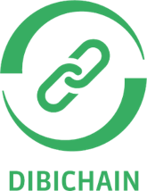
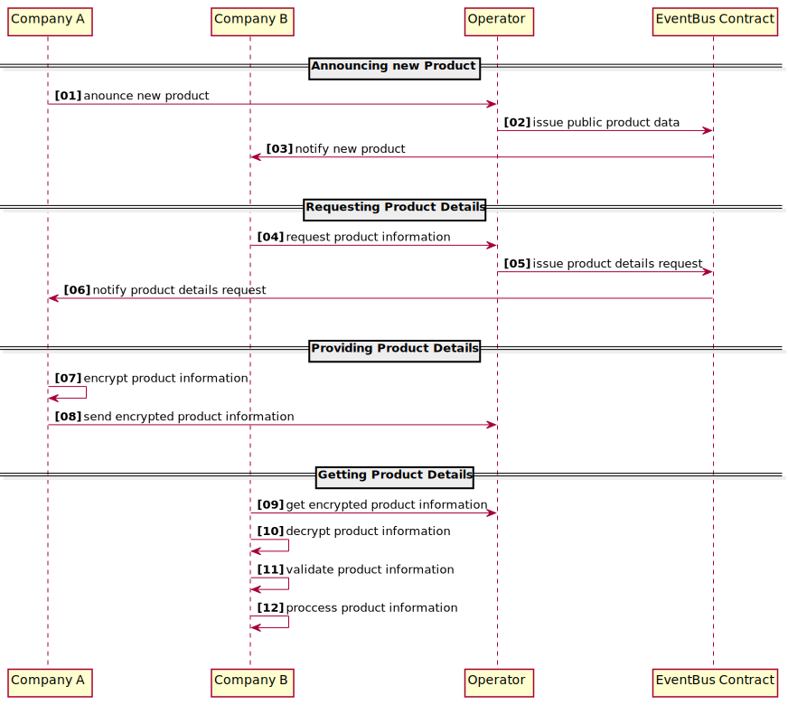

# Dibichain Demonstrator

This repository hosts the source code of the Dibichain demonstrator.

The demonstrator is part of the R&D project *ReZiProK - Verbundvorhaben: DIBICHAIN - Digitales Abbild von Kreislaufsystemen mittels einer Blockchain* funded by the german government with id *Förderkennzeichen: 033R241C*. 

More information can be found [here](https://innovative-produktkreislaeufe.de/resswinn/en/Projects/DIBICHAIN.html).

<i>Table of Contents</i>

- [Dibichain Demonstrator](#dibichain-demonstrator)
  - [General](#general)
  - [Getting started](#getting-started)
    - [Local setup](#local-setup)
    - [Deployed setup](#deployed-setup)
      - [Logistex](#logistex)
      - [Logistly](#logistly)
      - [Operator](#operator)
      - [Block explorer](#block-explorer)

https://github.com/chainstep/dibichain-demo/blob/update-docu/docs/logos/BMBF.jpg

  

## General

The general idea of Dibichain is to provide product information to unknown participants without revealing the origin of these products.
To do so, it uses an EVM based smart contract as an event bus to broadcast the announcement of new products and interests in product details. A participant is able to either announce new products that one is in control of or to request details of products that one is interested in. Announcing a product requires revealing public available, non-critical product information that is open to everyone.
Requesting product information is an anonymous process where the requester is only identified by a one-time public key that is dynamically generated for each request. Responses to these requests are encrypted with the help of the requesters public keys. This ensures that only the requester is able to see the detailed product information.

To reduce complexity, a so called operator is used to issue transactions to the contract and to route messages between participants. Since the operator is a central entity and acts as a man-in-the-middle, all participant are required to trust the operator. For further development it is recommended to either remove the operator from the Dibichain system and use a peer-to-peer approach, or to decentralize the operator to a network of operators to mitigate company to public key correlation.

The following diagram should give a high level overview of the Dibichain demonstrator flow: (a detailed description of the workflow can be found [here](docs/markdown/detailed-flow.md))

## Getting started

To demonstrate the workflow, a setup with two virtual companies has been added and can be run in a local environment on your machine or accessed in the cloud. The first company (**Company A**) is named **Logistex** and the second company (**Company B**) **Logistly**.
Each company consists of a dibichain client and frontend.

The [**client**](packages/company-client/) contains the business logic and can be integrated into a companies infrastructure with the help of the provided docker files.

The [**frontend**](packages/company-frontend/) acts as an human interface and should be used to interact with the dibichain demonstrator for all non-machine interactions.

The [**operator**](packages/operator/) acts, as described above, as an intermediate for company-to-company communication and is used to abstract blockchain specific complexity from the company clients. It should be mentioned that even if the operator is able to track the company-to-company messages, it is not able to see the product details due to the end-to-end encryption.

### Local setup

To run the demonstrator on your local machine follow the steps described [here](local-demo/README.md)

### Deployed setup

To access the deployed setup follow these links:

#### Logistex

- frontend url: https://www.logistex.dibichain.de
- client url: https://api.logistex.dibichain.de
- client api docs url: https://api.logistex.dibichain.de/api-docs

#### Logistly

- frontend url: https://www.logistly.dibichain.de
- client url: https://api.logistly.dibichain.de
- client api docs url: https://api.logistly.dibichain.de/api-docs

#### Operator

- api url: https://api.operator.dibichain.de

#### Block explorer

- explorer url: https://explorer.dibichain.de