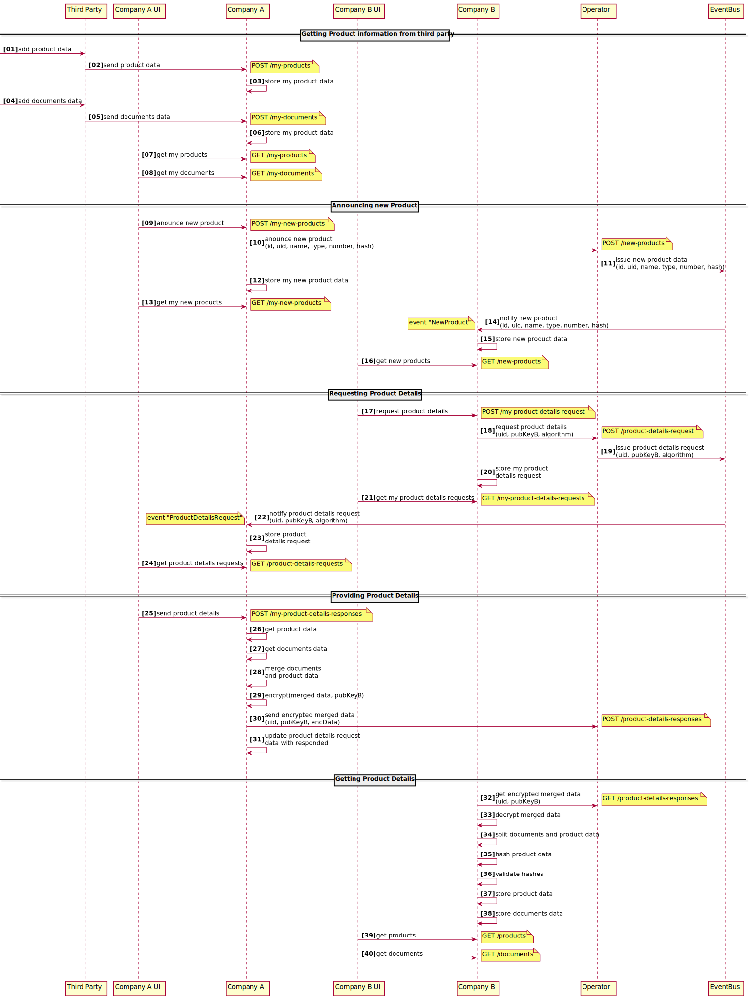

# Detailed Dibichain workflow

As described [here](../../README.md#general), the idea of Dibichain is to provide and consume product information in an anonymous fashion. To do so, the Dibichain system uses an [EVM](https://ethereum.org/en/developers/docs/evm/) compatible [Smart Contract](https://ethereum.org/en/developers/docs/smart-contracts/) as an event bus to broadcast two types of events, the *new product* and *product details request* event. Every participant (company) is able to issue and listen to these two event types. If a company decided to broadcast a new product, it can do so by issuing a transaction to the event bus contract with public available, non critical information. The company is also required to provide a hash of the full product information data set, so that a product details requester is later able to verify the received product details. It should be mentioned that no company related information is required to broadcast a new product, so that the product issuer stay anonymous. 

To reduce complexity for the Dibichain demonstrator, an operator is installed that handles the transaction issuing for the companies. It also acts as a central point for company-to-company messaging.

When a company receives a *new product event*, it can decide if it is interested in the details and issue a *product details request* via the operator. To do so, it first generates a new asymmetric key pair and adds the public key to the request along with the unique identifier of the product the company is interested in. After receiving such an event, the company that issued the *new product* event again decides if it wants to response to the request or not. If it declines, it just does nothing and the request times out. If it decides to answer the request, it encrypts the full product details information including the associated documents with the provided public key and sends the encrypted data to the operator. The requesting company in the mean time polls the operator for answer messages of its request. After receiving the encrypted data message from the provider company it forwards the message to the requester company in the next answer message poll.

The requester company now decrypts the product details and validates the data by comparing a self-created hash with the hash stored in the *new product* event. If everything checks out, the request company received the complete product information set from the provider company in an completely anonymous way.

Even though the above described mechanism works entirely in a machine-to-machine way, a company frontend is provided to showcase the flows.

The following diagram shows a detailed sequence diagram of the flows needed to enter a product including its documents to the Dibichain demonstrator up to the point where one product is send from company A to company B.

